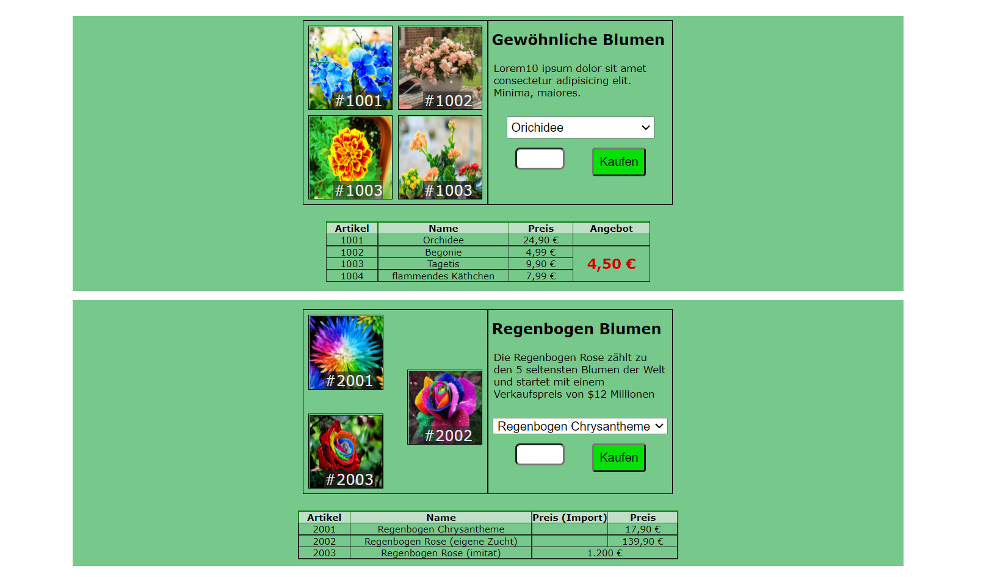

# Übungsaufgabe zum Thema Positioning, Forms und resonsive

## Rahmenbedingungen

- font-family: Verdana, Geneva, Tahoma, sans-serif

- section width: 80%
- bg color: #1da33e99

- viele Paddings sind 0.5rem
- wir haben nur 60 Minuten Zeit, daher denkt dran, dass die zwei sections relativ ähnlich sind ;)
- die beiden Texte können Lorem10 sein

- Responsive design werden wir wohl in den 60 Minuten nicht schaffen, daher könnten wir das bis morgen machen (am We bin ich nicht da)

Wie immer ist das wichtigste: Habt Spaß!